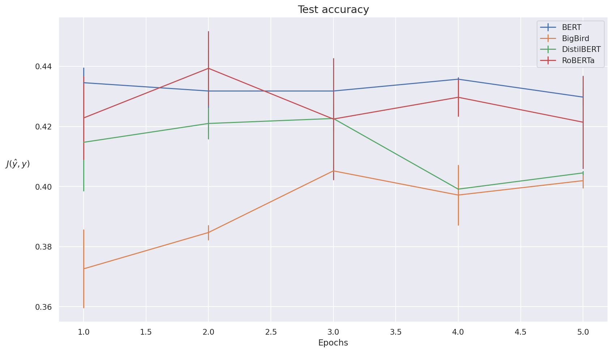

# GoEmotions
Sentiment analysis over GoEmotions dataset. In collaboration with [@orientino](https://github.com/orientino) and [@Gerlando30](https://github.com/Gerlando30).

## Description

We performed sentiment analysis over the [GoEmotions](https://arxiv.org/abs/2005.00547) dataset.

The objective of our work was to replicate the baseline model BERT experimented in the aforementioned paper, and then extend the analysis to multiple models derived from the same BERT.

In particular, we tested the following models:
- BERT
- BigBird
- DistilBERT
- RoBERTa

## Repository

📂GoEmotions                                 
├─ 📂analysis                                
│  ├─ 📄analysis_ekman.ipynb                 
│  ├─ 📄analysis_group.ipynb                 
│  └─ 📄analysis_original.ipynb              
├─ 📂config                                  
│  ├─ 📄ekman.json                           
│  ├─ 📄group.json                           
│  └─ 📄original.json                        
├─ 📂data                                    
│  ├─ 📂ekman                                
│  │  ├─ 📄dev.tsv                           
│  │  ├─ 📄labels.txt                        
│  │  ├─ 📄test.tsv                          
│  │  └─ 📄train.tsv                         
│  ├─ 📂group                                
│  │  ├─ 📄dev.tsv                           
│  │  ├─ 📄labels.txt                        
│  │  ├─ 📄test.tsv                          
│  │  └─ 📄train.tsv                         
│  └─ 📂original                             
│     ├─ 📄dev.tsv                           
│     ├─ 📄labels.txt                        
│     ├─ 📄test.tsv                          
│     └─ 📄train.tsv                         
├─ 📂src                                     
│  ├─ 📄bert_goemotions_pytorch.ipynb        
│  ├─ 📄bigbird_goemotions_pytorch.ipynb     
│  ├─ 📄distilbert_goemotions_pytorch.ipynb  
│  └─ 📄roberta_goemotions_pytorch.ipynb     
└─ 📄README.md                               
  
The structure of the repository is showed above. In the _src/_ folder you can find the different notebook used for the experiments. If you want to replicate them, we suggest to change the baseline path directory based on you current file path accordingly.

We included also the different data and config files used to perform the experiment, plus the post analysis in the _analysis/_ folder.

## Results

We were able to reach the result of the original paper with an accuracy of around __0.45__ for the baseline BERT.
We discovered also that using a lightweight model as DistilBERT or a complex one like RoBERTa, slightly improve the results with respect to classical BERT.

Below we report the mean accuracy and standard deviation obtained over runs with different starting seeds for the tested models on the original taxonomy

